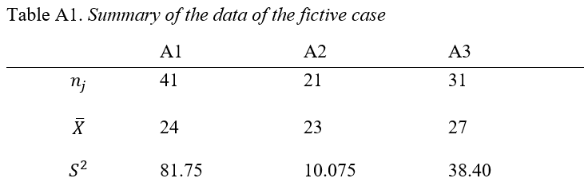

---
output:
  pdf_document: default
  html_document: default
---
\setlength{\parindent}{0.0in}
\setlength{\leftskip}{0.0in}

## Appendix 1: The Mathematical Development of the *F*-test, *W*-test, and *F*\*-test: Numerical Example 

A summary is presented in Table A1. The complete example is available on Github. The DV is a score that can vary from 0 to 40. The IV is a three-level factor A (levels = $A_1$, $A_2$ and $A_3$). 

```{r "", echo=FALSE, out.width = '100%',fig.cap = ""}

```

```{r "", echo=FALSE, out.width = '100%',fig.cap = ""}
n=c(41,21,31)
mu=c(24,23,27)
var=c(81.75,10.075,38.40)
k=length(n)
N=sum(n)
global_mu=sum(n*mu)/sum(n)
w_j=n/var
w=sum(n/var)
muprime=sum(w_j*mu)/w
```
The global mean (i.e. the mean of the global dataset) is a weighted mean of the group means: 

$$\frac{(`r n[1]`*`r mu[1]`)+(`r n[2]`*`r mu[2]`)+(`r n[3]`*`r mu[3]`)}{`r n[1]`+`r n[2]`+`r n[3]`}=\frac{`r sum(n*mu)`}{`r sum(n)`} \approx `r round(sum(n*mu)/sum(n),2)`$$

The *F*-test statistic and degrees of freedom are computed by applying formulas (1), (2) and (3):

$$
F=\frac{\frac{1}{`r k`-1}[`r n[1]`*(`r mu[1]`-\frac{`r sum(n*mu)`}{`r sum(n)`})^2+`r n[2]`*(`r mu[2]`-\frac{`r sum(n*mu)`}{`r sum(n)`})^2+`r n[3]`*(`r mu[3]`-\frac{`r sum(n*mu)`}{`r sum(n)`})^2]}
{\frac{1}{`r N`-`r k`}[(`r n[1]`-1)*`r var[1]`+(`r n[2]`-1)*`r var[2]`+(`r n[3]`-1)*`r var[3]`]} \approx `r round(((1/(k-1))*(sum(n*(mu-global_mu)^2)))/((1/(N-k))*(sum((n-1)*var))),3)
`
$$

$$
df_n=`r k`-1=`r k-1`
$$

$$
df_d=`r N`-`r k`=`r N-k`
$$

The *F*\*-test and his degrees of freedom are computed by applying formulas 4, 5 and 6:

$$
F^*=\frac{`r n[1]`*(`r mu[1]`-\frac{`r sum(n*mu)`}{`r sum(n)`})^2+`r n[2]`*(`r mu[2]`-\frac{`r sum(n*mu)`}{`r sum(n)`})^2+`r n[3]`*(`r mu[3]`-\frac{`r sum(n*mu)`}{`r sum(n)`})^2}{(1-\frac{`r n[1]`}{`r N`})*`r var[1]`+(1-\frac{`r n[2]`}{`r N`})*`r var[2]`+(1-\frac{`r n[3]`}{`r N`})*`r var[3]`} \approx `r round((sum(n*(mu-global_mu)^2))/(sum((1-(n/N))*var)),3)`
$$

$$
df_n=`r k`-1=`r k-1`
$$

$$
df_d=\frac{1}{\frac{(\frac{(1-\frac{`r n[1]`}{`r N`})*`r var[1]`}{\sum_{j=1}^k(1-\frac{n_j}{N})s_j^2})^2}{`r n[1]`-1}+\frac{(\frac{(1-\frac{`r n[2]`}{`r N`})*`r var[2]`}{\sum_{j=1}^k(1-\frac{n_j}{N})s_j^2})^2}{`r n[2]`-1}+\frac{(\frac{(1-\frac{`r n[3]`}{`r N`})*`r var[3]`}{\sum_{j=1}^k(1-\frac{n_j}{N})s_j^2})^2}{`r n[3]`-1}} \approx `r round(1/sum(((1-n/N)*var/sum((1-n/N)*var))^2/(n-1)),3)`
$$

$$ Where \sum_{j=1}^k(1-\frac{n_j}{N})*s_j^2 \approx `r round(sum((1-n/N)*var),2)`$$

Finally, the *W*-test and his degrees of freedom are computed in applying formulas 7, 8 and 9:

$$
W=\frac{\frac{1}{`r k`-1}[\frac{`r n[1]`}{`r var[1]`}(`r mu[1]`-\bar{X'})^2+\frac{`r n[2]`}{`r var[2]`}(`r mu[2]`-\bar{X'})^2+\frac{`r n[3]`}{`r var[3]`}(`r mu[3]`-\bar{X'})^2]}
{\frac{2(`r k`-2)}{`r k`^2-1}[(\frac{1}{`r n[1]`-1})(1-\frac{\frac{`r n[1]`}{`r var[1]`}}{w})^2+(\frac{1}{`r n[2]`-1})(1-\frac{\frac{`r n[2]`}{`r var[2]`}}{w})^2+(\frac{1}{`r n[3]`-1})(1-\frac{\frac{`r n[3]`}{`r var[3]`}}{w})^2]+1} \approx `r round(1/(k-1)*(sum(n/var*(mu-muprime)^2))/((2*(k-2))/(k^2-1)*sum(1/(n-1)*(1-(n/var)/w)^2)+1),3)`
$$

Where:

$w=\sum_{j=1}^k w_j \approx `r round(sum(w_j),2)`$ 

$\bar{X'}=\frac{\sum_{j=1}^k (w_j\bar{x_j})}{w} \approx `r round(muprime,2)`$

$$
df_n=`r k`-1
$$

$$
df_d=\frac{`r k`^2-1}{3[\frac{(1-\frac{w_j}{w})^2}{`r n[1]`-1}+\frac{(1-\frac{w_j}{w})^2}{`r n[2]`-1}+\frac{(1-\frac{w_j}{w})^2}{`r n[3]`-1}]} \approx `r round((k^2-1)/(3*(sum((1-w_j/w)^2/(n-1)))),2)`
$$

One should notice that in this example, the biggest sample size has the biggest variance. As previously mentioned, it means that the *F*-test will be too conservative, because the *F* value decreases. The *F*\*-test will also be a little too conservative, even if the test is less affected than the *F*-test. As a consequence: *W* > *F*\* > *F*. 

## Appendix 2: Justification for the choice of distributions in simulations

The set of simulations described in the article was repeated for 7 distributions. We used R commands to generate data from different distributions:

- *k* normal distributions (Figure A1): in order to assess the Type I error rate and power of the different tests under the assumption of normality, data were generated by means of the function "rnorm" (from the package "stats"; "R: The Normal Distribution," 2016).

- *k* double exponential distributions (Figure A2): In order to assess the impact of high kurtosis on the Type I error rate and power of all tests, data were generated by means of the function "rdoublex" (from the package "smoothmest"; "R: The double exponential (Laplace) distribution," 2012).  

- *k* mixed normal distributions (Figure A3): In order to assess the impact of extremely high kurtosis on the Type I error rate and power of all tests, regardless of variance, data were generated by means of the function "rmixnorm" (from the package "bda"; Wang & Wang, 2015).  

- *k* normal right skewed distributions (Figure A4): In order to assess the impact of moderate skewness on the Type I error rate and power, data were generated by means of the function "rsnorm" (from the package "fGarch"; "R: Skew Normal Distribution," 2017). The normal skewed distribution was chosen because it is the only skewed distribution where the standard deviation ratio can vary without having an impact on skewness. 

- *k*-1 normal left skewed distributions (Figure A5) and 1 normal right skewed distribution (Figure A2.4): In order to assess the impact of unequal shapes, in terms of skewness, on the Type I error rate and power, when data have moderate skewness, data were generated by means of the functions "rsnorm" (from the package "fGarch"; "R: Skew Normal Distribution," 2017). 

- *k*-1 chi-squared distributions with two degrees of freedom (See Figure A6), and one normal rigt skewed distribution (Figure A2.4): In order to assess the impact of high asymetry on the Type I error rate an power, k-1 distributions were generated by means of the functions "rchisq" ("R: The (non-central) Chi-squared Distribution," 2016). The last distribution was generated by means of "rsnorm" in order to follow a normal right skewed distribution with a mean of 2 (from the package "fGarch"; "R: Skew Normal Distribution," 2017). Because the chi-squared is non-negative, it is not possible to generate chi-squared where population SD= 1, 4 or 8 and population mean is the same than the chi-squared with two degrees of freedom. However, we wanted to assess the impact of different SD-ratio on Type I error rate. For these reasons, the last distribution was generated by means of "rsnorm" in order to follow a normal skewed distribution with positive skewness of +0.99 and mean = 2 (from the package "fGarch"; "R: Skew Normal Distribution," 2017). 

- *k*-1 chi-squared distributions with two degrees of freedom (See Figure A6), and one normal left skewed distribution (Figure A5): In order to assess the impact of unequal shapes, in terms of skewness, on Type I error rate and power when distributions have extreme skewness, k-1 distributions were generated by means of the functions "rchisq" ("R: The (non-central) Chi-squared Distribution," 2016). The last distribution was generated by means of "rsnorm" in order to follow a normal right skewed distribution with a mean of 2 (from the package "fGarch"; "R: Skew Normal Distribution," 2017)

